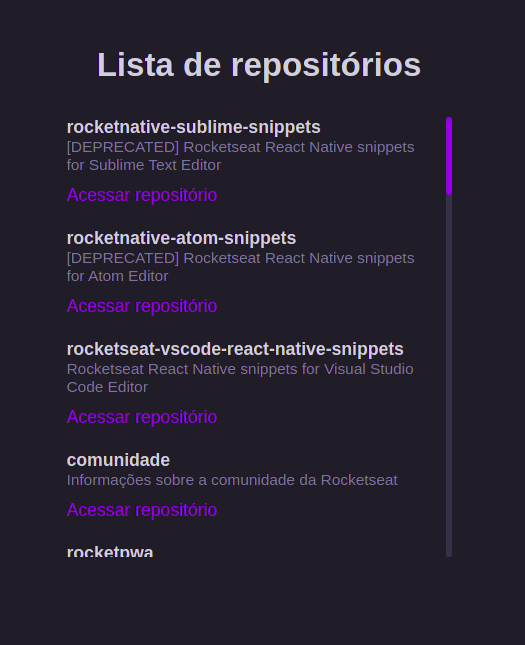

# LISTA DE REPOSITÓRIOS

## Configuração ambiente

Nessa primeira aula tivemos um overview do que será abordado nessas primeiras aulas, em que o React pode ser usado e como ele funciona.

Iremos aprender muito sobre os fundamentos do frontend e fundamentos mais específicos do próprio React:

- Componentização
- Estado
- Imutabilidade
- Propriedades
- Hooks (useState, useEfect)
- TypeScript

E também vimos outros tópicos como:
Configurar a estrutura de um projeto React do zero;

- Webpack
- Babel

## Conceitos importantes

primeiro conseito construir o segundo componente React e entender como funciona a interpolação de código JavaScript dentro do código HTML de um componente.

O segundo conceito a ser aprendido no React é o conceito de propriedade. Como as informações são compartilhadas entre dois ou mais componentes e como podemos usar isso a nosso favor para deixarmos as responsabilidades bem separadas no projeto.

Nessa aula iremos aprender sobre estado no React, como ele gerencia mudanças de informações para refletir no conteúdo exibido em tela e como fazemos o gerenciamento de estado com o hook useState.

Nessa aula iremos entender como funciona e como é aplicado o conceito da imutabilidade. É importante também entendermos o motivo pelo qual o React trabalha melhor quando aplicamos esse conceitos nos nossos projetos.

## Fundamentos do TypeScript

Nessa aula iremos entender os fundamentos do TypeScript, como funciona a tipagem das informações que estamos tratando e como isso nos ajuda - e muito - a lidar com tarefas onde precisamos saber o formato dos dados.

 
 

  

