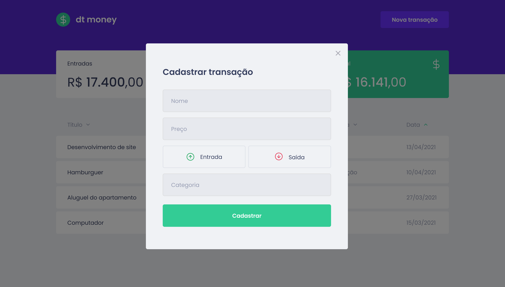

<div align="center">
  
</div>

## Instalação e uso

```bash
  # Abra um terminal e copie este repositório com o comando
  git clone
  # ou use a opção de download.

  # Entre na pasta web com
  cd

  # Instale as dependências
  yarn

  # Rode a aplicação
  yarn start
```

## Sobre o dt money

O dt money é uma alternativa simples e eficaz para gerenciar suas finanças, permitindo o cadastro de entradas, saídas e a organização das mesmas em categorias.

## Tecnologias

- Javascript
- Typescript
- Axios
- Miragejs
- Styled components
- Reactjs (CRA), hooks, context

## Layout

<div align="center">
  
  
  
  
</div>
